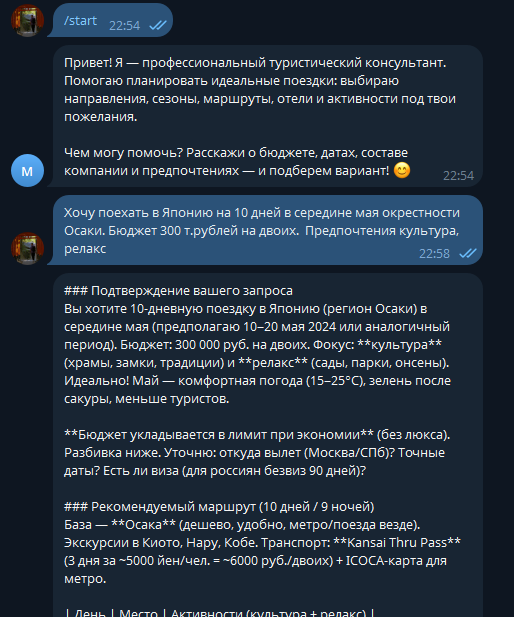

## Отчёт о выполнении задания по модулю M03 «AI-driven разработка»

### Название проекта и краткое описание

**Название проекта:** LLM-ассистент — Telegram-бот туристического консультанта.  
Проект реализует чат-бота в Telegram, который с помощью LLM ведёт естественный диалог и помогает пользователю планировать путешествия: подбирать направления, маршруты, отели и активности. Решение создавалось как учебный MVP в рамках курса «AI-driven разработка ИИ-агентов».

### Роль ИИ-ассистента и обоснование выбора

Выбрана роль **профессионального туристического консультанта**.  
Такой ассистент демонстрирует сильные стороны LLM: умение работать с открытыми задачами, учитывать множество параметров (даты, бюджет, предпочтения, состав путешественников) и формировать структурированные рекомендации без необходимости точных внешних данных или сложной доменной логики на стороне бэкенда.

### Реализованные возможности

- [x] Каркас Telegram-бота на `aiogram` и запуск через `polling`
- [x] Базовый эхо-режим на первом шаге разработки
- [x] Интеграция с LLM через OpenRouter и клиент `openai`
- [x] Передача в LLM системного промпта с ролью туристического консультанта
- [x] Хранение контекста диалога в оперативной памяти по `user_id` (история последних сообщений)
- [x] Команда `/start` с приветствием, описанием роли и примерами запросов
- [x] Команда `/help` с краткой справкой по возможностям бота и советами по формулировке запросов
- [x] Команда `/reset` для очистки истории диалога текущего пользователя
- [x] Обработка ошибок при обращении к LLM с нейтральным ответом пользователю при сбоях
- [x] Базовое логирование запуска, входящих сообщений, вызовов LLM и ошибок
- [x] Конфигурация через `.env` и модуль `config.py` с проверкой критичных переменных окружения

### Технологический стек

- **Язык и окружение:** Python 3.11, управление зависимостями и запуск через `uv`
- **Telegram:** фреймворк `aiogram` (v3), получение обновлений через `polling`
- **LLM и API:** клиент `openai` для работы с OpenRouter (OpenAI-совместимый чат API)
- **Оркестрация:** `make` для типовых команд разработки и запуска бота
- **Конфигурация:** `.env` + самописный модуль `config.py`
- **Логирование:** стандартный модуль `logging` (вывод в stdout)

### Инструменты AI-driven разработки

- **Используемая AI-coding IDE:** Cursor (интерактивная разработка, автодополнение кода, рефакторинг и навигация по проекту с помощью встроенного ИИ-ассистента).
- **Используемые LLM-модели для генерации документации и кода:** модели семейства GPT, в частности GPT-5.1 внутри Cursor для генерации кода бота, конфигурации, документации и этого отчёта.

### Скриншот работы

Ниже приведён пример диалога с ботом (ответ ассистента в Telegram):

Дополнительно в директории `report/` сохранены скриншоты команд `/echo`, `/help`, `/reset` и логов работы бота.

### Процесс разработки: основные вызовы и решения

- **Интеграция с OpenRouter и конфигурация через окружение.**  
  Важно было правильно настроить клиент `openai` на работу с альтернативным провайдером (OpenRouter), передав базовый URL и модель из переменных окружения. Это решено выделением модуля `config.py` и тонкого слоя `llm.py`, который изолирует детали вызова API от остального кода.
- **Управление контекстом диалога без БД.**  
  Задача — хранить историю диалога для улучшения качества ответов, не выходя за рамки простого MVP. Это реализовано через in-memory структуру `dialog_context` с ограничением длины истории и очисткой по команде `/reset`.
- **Баланс между простотой и надёжностью.**  
  Нужно было соблюсти принципы KISS/YAGNI, но при этом обеспечить предсказуемое поведение при ошибках LLM или сети. Для этого все сетевые вызовы к LLM обёрнуты в `try/except` с логированием и единым нейтральным сообщением пользователю при сбоях.
- **Работа по итерационному плану с AI-помощником.**  
  Разработка велась по шагам из `docs/tasklist.md`: от эхо-бота до полноценного диалога с контекстом, командами и логированием. На каждом этапе AI-ассистент в Cursor помогал уточнять архитектуру, формировать хендлеры `aiogram` и дорабатывать документацию.

### Что я узнал нового в процессе AI-driven разработки

1. **Как формулировать задачи для ИИ-ассистента так, чтобы он генерировал не просто код, а небольшие, осмысленные итерации, хорошо вписывающиеся в существующую архитектуру.**
2. **Насколько эффективно ИИ помогает поддерживать единый стиль проекта:** выносить конфигурацию в отдельный модуль, не дублировать системный промпт, соблюдать KISS/YAGNI без избыточных абстракций.
3. **Практику использования LLM как «соработника», а не генератора финального решения:** проверки логики, уточнение краевых случаев, предложение вариантов обработки ошибок и логирования.
4. **Важность явного описания роли ассистента в системном промпте:** небольшие правки формулировок заметно меняют тон и структуру ответов бота.
5. **То, что AI-driven подход особенно хорошо работает в связке с простым, модульным кодом:** чем понятнее структура (`bot.py`, `llm.py`, `config.py`), тем точнее и полезнее подсказки и правки, которые предлагает ИИ.

